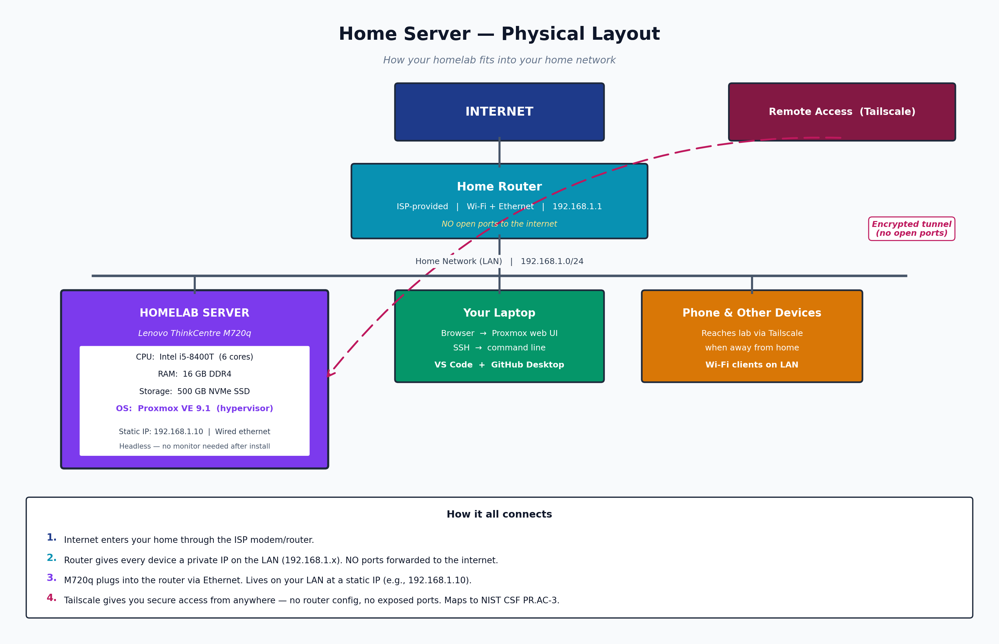
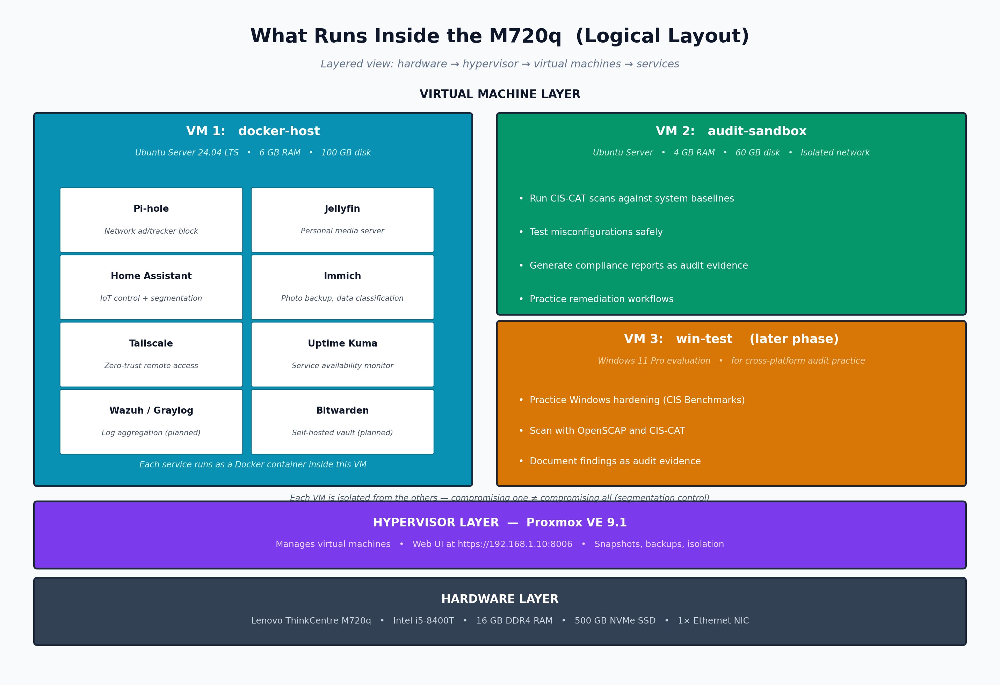

# 🛡️ Homelab — A Hands-On GRC Learning Lab

> Building a personal homelab and treating it like a small business: assessing risks, applying controls, and documenting evidence — the way a GRC analyst would.

**Status:** 🟡 Pre-launch — hardware arriving early May 2026
**Career goal:** Aspiring GRC analyst, focused on IT audit & compliance
**Currently studying:** [CompTIA Security+ (SY0-701)](https://www.comptia.org/certifications/security)

---

## 🎯 Why This Repo Exists

Most homelab repos document *how* to build things. This one focuses on **why** — the risk decisions, control choices, and compliance considerations behind every part of the build.

I'm pivoting into Governance, Risk, and Compliance (GRC). To understand what I'll one day audit, I need to first understand how IT systems are actually designed, secured, and operated. This homelab is my classroom.

Every service I deploy is documented with:

- **Risk assessment** — what could go wrong, how likely, how bad
- **Controls applied** — what I did to prevent or detect it
- **Framework mapping** — how those controls align to NIST CSF, CIS Controls v8, and ISO 27001:2022
- **Evidence** — screenshots, configs, logs that prove the control works

---

## 🖥️ The Environment Under Audit

| Component | Model | Specs | Cost |
|-----------|-------|-------|------|
| Server | Lenovo ThinkCentre M720q Tiny | Intel i5-8400T (6 cores), 16GB DDR4, 500GB NVMe | $250 |
| Bootable USB | SanDisk Ultra Flair 128GB USB 3.0 | Proxmox installer | $26 |
| **Total investment** | | | **$276** |

---

## 🧱 Architecture

### Physical Layout — How the homelab fits into my home network

The M720q lives on my home LAN behind the router, with no ports forwarded to the internet. Remote access is handled exclusively through Tailscale — an encrypted, zero-trust tunnel that maps cleanly to NIST CSF **PR.AC-3** (remote access management) and CIS Control **12.7** (secure remote access).

### Logical Layout — What runs inside the server

Proxmox VE 9.1 acts as the hypervisor, hosting isolated virtual machines:

- **VM 1 — `docker-host`** — Always-on services running as Docker containers (Pi-hole, Jellyfin, Home Assistant, Immich, Tailscale, Uptime Kuma). Future additions: Wazuh/Graylog for log aggregation and Bitwarden for self-hosted credential storage.
- **VM 2 — `audit-sandbox`** — Isolated environment for running CIS-CAT scans, testing misconfigurations safely, and generating compliance reports as audit evidence.
- **VM 3 — `win-test`** *(later phase)* — Windows 11 evaluation VM for cross-platform hardening practice and CIS Benchmark scans.

VM isolation is itself a control — compromising one VM does not equal compromising all of them. This maps to NIST CSF **PR.AC-5** (network integrity protected) and CIS Control **4** (secure configuration of enterprise assets).
